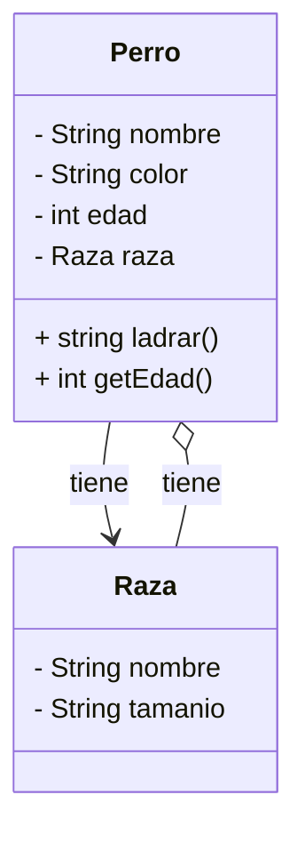

## Ejercicio 1

```mermaid
classDiagram

    class Perro{
        - String nombre
        - String color
        - int edad
        - Raza raza

        + string ladrar()
        + int getEdad()
    }

    class Raza{
        - String nombre
        - String tamanio
    }

    Perro --> Raza: tiene
    Perro o-- Raza: tiene

```